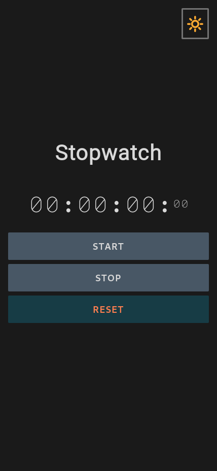
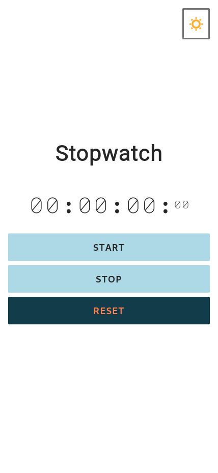
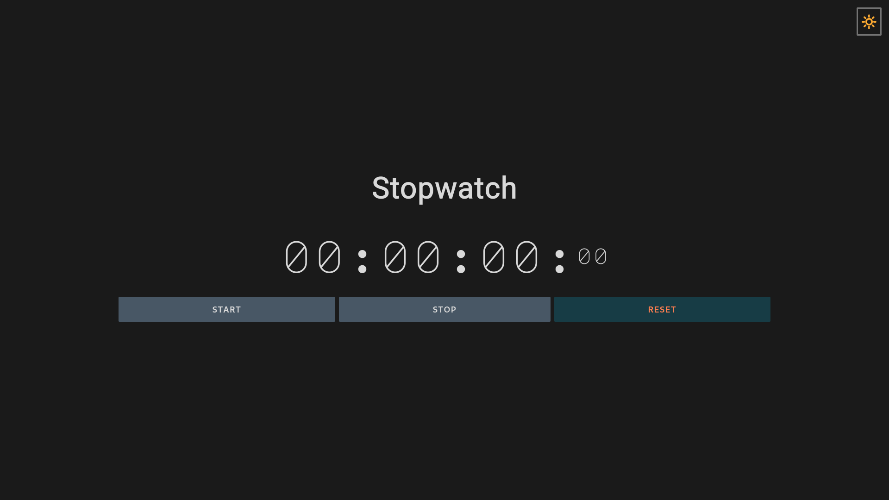
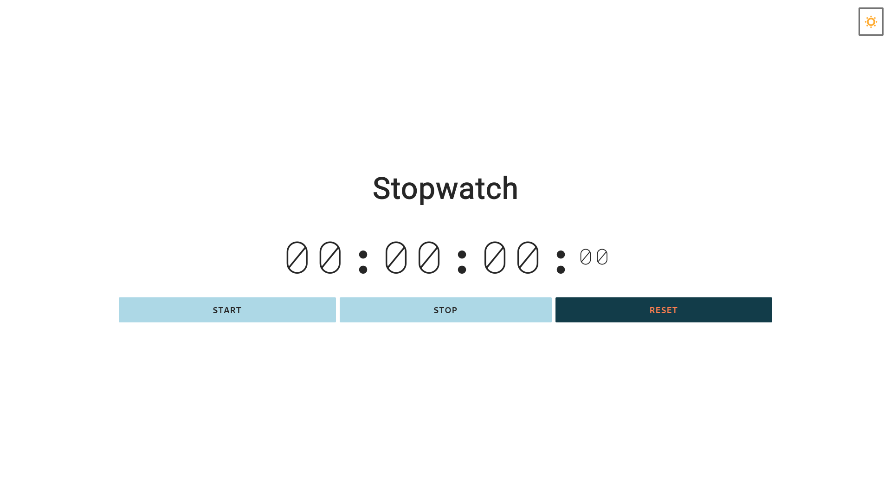

# Simple JS Stopwatch

A simple JavaScript based stopwatch with light and dark theme.

This was a personal challenge to make a simple web based utility. I learned a lot about how `setInterval` and associated functions work. I also took the opportunity to make an auto detecting theme for light or dark preference; the app's default is dark mode.

## Dev Details

### Styles

- All styles are located in the directory `css`, in the file `styles.css`.
- Colors are primairly set by css variables in `:root`.

### JavaScript

- All code is found in the `scripts` directory.
- Code is organized in a module style by treating `

## Mobile Screens

## Desktop Screens

